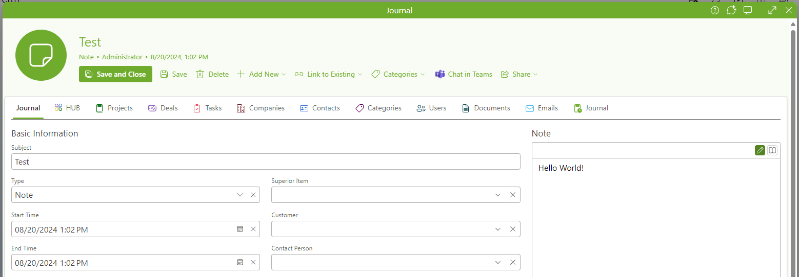

This is a sample [ExecutableTrigger](https://github.com/eway-crm/triggers?tab=readme-ov-file#Executable) for [eWay-CRM](https://www.eway-crm.com) created in Visual Studio Code.

For better C# support install [IntelliCode for C# Dev Kit](https://code.visualstudio.com/docs/csharp/intellicode).

A trigger definition is in (SampleExecutableTrigger.xml)[SampleExecutableTrigger.xml] file.

To build the project in Release mode call `dotnet build -c Release` from VS Code terminal.

As the project [requires](https://kb.eway-crm.com/en/documentation/2-installation/2-1-prerequisites/minimum-requirements) .NET Framework 4.7.2, the project must target x64 architecture, otherwise debugging would not be supported.

The sample program adds `Hello world!` to a journal note when a new journal is created.

